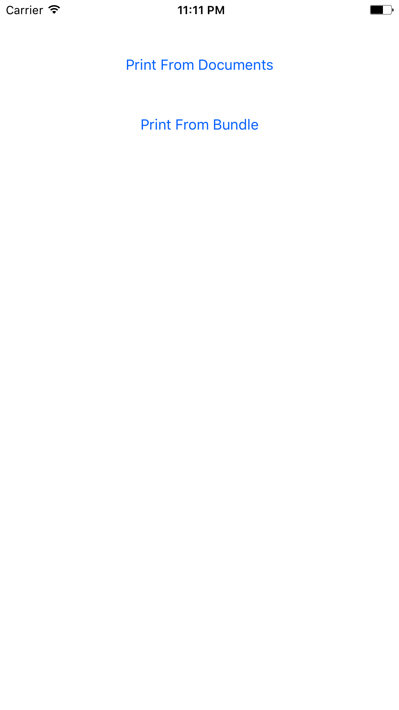
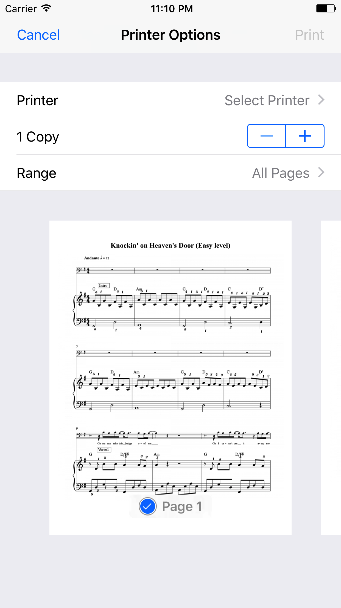

## UIPrintInteractionController Example
This is small example app that shows usage of UIPrintInteractionController. With this example, you have an ability to printing HTML file with local images from documents folder and from application bundle.

## Ussage example:
Printing html from documents folder:

```
NSURL *documentsUrl = [[[NSFileManager defaultManager] URLsForDirectory:NSDocumentDirectory inDomains:NSUserDomainMask] lastObject];
NSURL *printFolderUrl = [documentsUrl URLByAppendingPathComponent:@"Print"];
[[HTMLPrinter sharedPrinter] printHTMLWithName:@"index.html" fromFilePath:printFolderUrl.absoluteString];
```

Printing html from application bundle folder:

```
NSString *indexHtmlStringPath = [[[NSBundle mainBundle] bundleURL] absoluteString];
[[HTMLPrinter sharedPrinter] printHTMLWithName:@"index.html" fromFilePath:indexHtmlStringPath];
```

<p align="center">
  
</p>

<p align="center">
  
</p>
